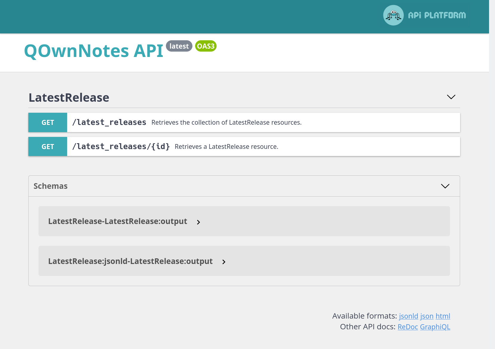

# [QOwnNotes Web API](https://github.com/qownnotes/api)

REST Web API used by [QOwnNotes](https://github.com/pbek/QOwnNotes) for checking if there is a new release and
what the changes were.

In addition, there also is a [Release RSS Feed](http://api.qownnotes.org/rss/app-releases) and
an implementation of the legacy update checking api for older versions of QOwnNotes.
